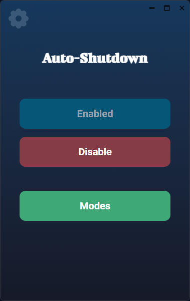

#  Auto-Shutdown 【⏻】

Auto-Shutdown is a sleek, modern Tauri application built with React and Typescript. It provides powerful and flexible system shutdown scheduling options in a lightweight, cross-platform package. Get precise control over when your computer powers down, restarts, or sleeps, all from an intuitive interface.

# 

## Core Features ⚡

*   **Native Power:** Leverages low level system commands via Rust direct, reliable system shutdown.
*   **Modern UI:** Built with React, React Router, and TailwindCSS for a responsive, smooth, and visually appealing single-page application experience.
*   **Persistent Settings:** Uses Tauri's store plugin to remember your preferences and schedules across sessions.
*   **Multiple Modes:** Choose from various shutdown triggers: timed countdown, specific schedule, or after a period of system idle time.
*   **Background Efficiency:** Runs discreetly in the background using minimal system resources.
*   **Instant Access:** Toggle the application window instantly with a global hotkey ***`(Ctrl + Shift + \)`***
*   **Compact Size:** Remarkably small application footprint ***(approx. `9MB`).***

## Screenshots 🖼️

<br>


**Main Window**: Clean, minimal interface designed for quick access to shutdown controls.
<br>


**Settings Window**: Customize application behavior, like autostart and notifications.
<br>


**Modes Window**: Select and configure your preferred shutdown trigger (Timer, Schedule, Idle).

<br>


**Shutdown Warning**: A clear 60-second countdown prompt before shutdown, giving you a chance to cancel.


## ✨ In-Depth Look at Features

Auto-Shutdown is designed to be powerful yet unobtrusive. Here's a closer look at what makes it stand out:

*   **Global Hotkey (`Ctrl + Shift + \`):** Instantly show or hide the application window from anywhere in your OS, whether it's focused or running in the background.
*   **Multiple Shutdown Modes:**
    *   ⏱️ **Timer Mode:** Set a specific duration (e.g., "shut down in 1 hour 30 minutes").
    *   🗓️ **Schedule Mode:** Plan shutdowns for specific dates and times (e.g., "shut down every Friday at 11 PM").
    *   💤 **Idle Mode:** Automatically trigger a shutdown after the system has been inactive for a defined period.
*   **System Autostart:** Configure the app to launch automatically when you log into your computer, ensuring your schedules are always active.
*   **Background Operation:** Runs efficiently in the system tray or background, consuming negligible CPU and RAM when idle. Perfect for "set it and forget it" usage.
*   **Lightweight & Compact:** With an installation size of around 9MB, it won't clutter your system or drain resources.
*   **Modern Audio Cues:** Utilizes subtle, useful sound notifications for key events (like the shutdown warning) without being annoying.
*   **Adjustable View Scale:** While respecting system scaling, the UI elements are designed to be clear and readable. *(Future enhancement: potentially add explicit in-app zoom)*.
*   **Graceful Shutdown Prompt:** The 60-second warning dialog (see screenshot above) ensures you're not caught off-guard and provides an easy way to cancel the pending action.

## Project Structure

```plaintext
/ (root)
├── logo.png           # Application logo.
├── README.md          # This file.
├── package.json       # Node dependecies and scripts.
├── tsconfig.json      # Typescript configuration.
├── vite.config.ts     # Vite configuration.
├── public/            # Public assets (other than logo).
├── screenshots/       # Application screenshots.
├── src/               # React source code.
│   ├── App.css        # App level styles.
│   ├── App.tsx        # Main App component.
│   ├── components/    # Reusable React components.
│   ├── lib/           # Utility library (e.g., store management).
│   ├── pages/         # Application pages (Home, Settings, Mode).
│   └── main.tsx       # Application entry point.
└── src-tauri/         # Tauri integration (Rust backend).
```

## Setup and Development 🛠️

1.  **Prerequisites:** Ensure you have Node.js, npm/yarn/pnpm, and the Rust development environment with Tauri prerequisites installed. [Tauri Setup Guide](https://tauri.app/v1/guides/getting-started/prerequisites).

2.  **Install Dependencies:**
    Navigate to the project root and run:
    ```sh
    npm install
    # or yarn install / pnpm install
    ```

3.  **Start Development Server:**
    To run the app in development mode with hot-reloading for the frontend:
    ```sh
    npm run dev
    ```
    This command starts both the Vite frontend server and the Tauri backend.

4.  **Build for Production:**
    To create optimized, distributable application bundles:
    ```sh
    npm run build
    ```
    The output will be located in `src-tauri/target/release/bundle/`.

5.  **Tauri Commands:**
    To interact directly with the Tauri CLI (e.g., for plugin management or specific build tasks):
    ```sh
    npm run tauri -- [tauri command]
    # Example: npm run tauri plugin add store
    ```

## Recommended IDE Setup 💻

*   [VS Code](https://code.visualstudio.com/)
*   [Tauri for VS Code](https://marketplace.visualstudio.com/items?itemName=tauri-apps.tauri-vscode) - Official Tauri extension.
*   [rust-analyzer](https://marketplace.visualstudio.com/items?itemName=rust-lang.rust-analyzer) - Essential for Rust development.

## Tech Used 🧑‍💻


## Contributing 👥

Contributions are welcome! If you find a bug, have a feature request, or want to improve the codebase, feel free to:

1.  Open an issue to discuss the change.
2.  Fork the repository.
3.  Create your feature branch (`git checkout -b feature/AmazingFeature`).
4.  Commit your changes (`git commit -m 'Add some AmazingFeature'`).
5.  Push to the branch (`git push origin feature/AmazingFeature`).
6.  Open a Pull Request.

## License ⚖️

This project is licensed under the MIT License - see the `LICENSE` file (if present) for details.

> ## ⚠️ **Warning:**
>
> This project is still under development. While core functionality is being built, some features might be incomplete or subject to change.